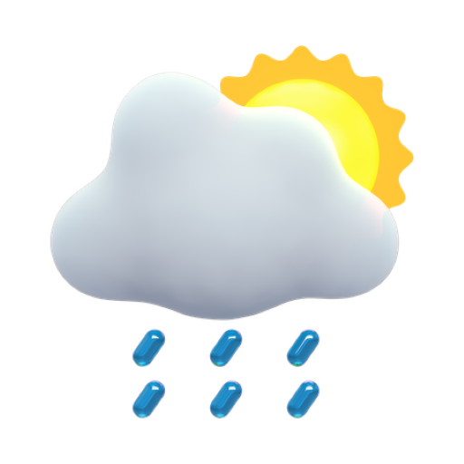
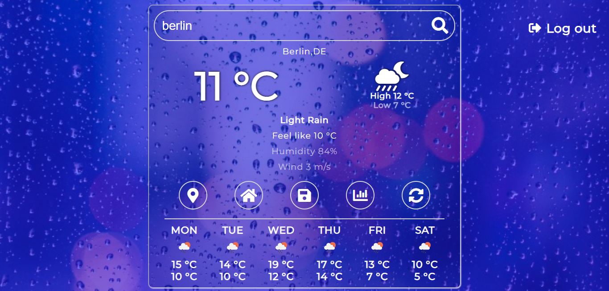
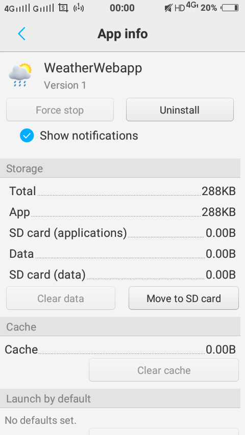
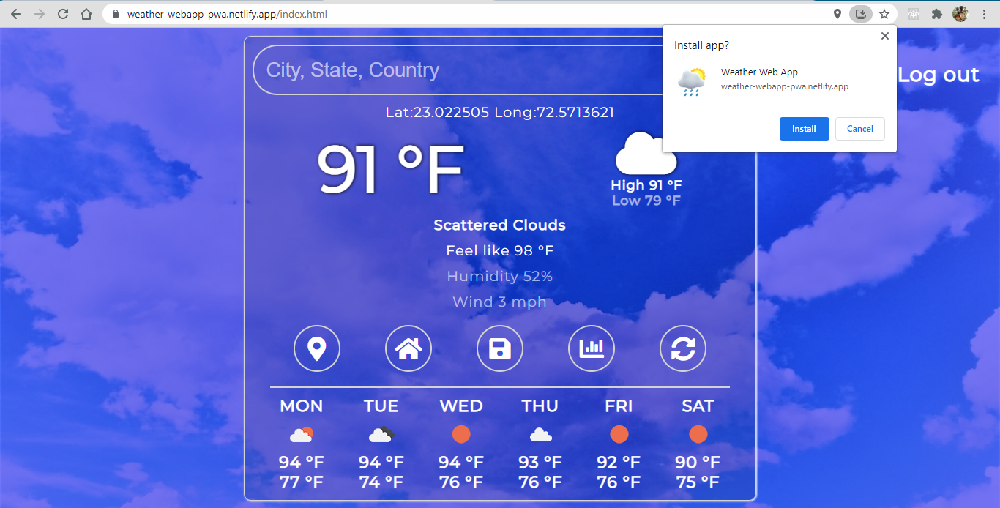
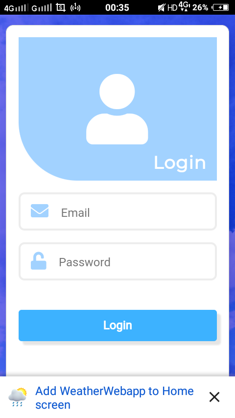
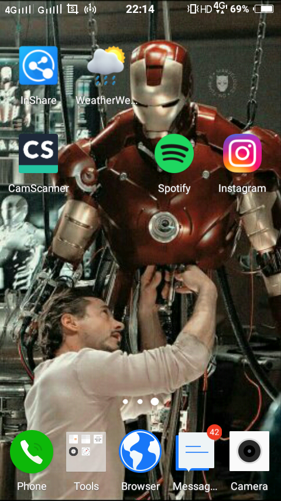
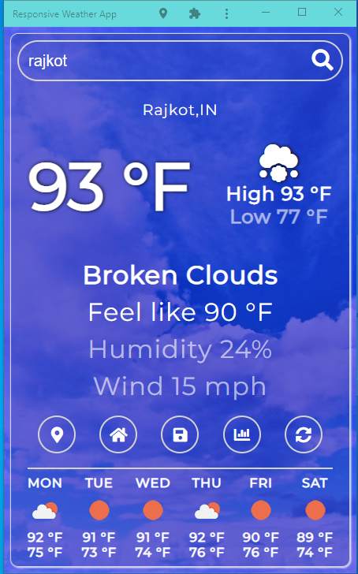

  

<h3 align="center">Wether Web App</h3>

---

## 📝 Table of Contents

- [About](#about)
- [how to install app](#usage)
- [Built Using](#built_using)

## 🧐 About 

 
 

 
 

It's a weather web application which is used for get the general information about current weather of any place as well as seven day forecasting details.

It's an installable web application.

 

 
 

## 🎈 How to install app 

- first open the website in a browser and it will shows the intall button in a url bar for pc and a banner for a mobile.

 
 

 
 

- after that install it.

- confirm the prompt box which is asking about save app icon in a home screen for a mobile.

 

 
 

- now the app is ready for usage, open it by click on app icon at home screen and it will work same as normal app.

 
 

## ⛏️ Built Using 

- [firebase](https://firebase.google.com/) - Database
- [JavaScript](https://www.javascript.com/) - Programming language
- [SASS](https://sass-lang.com/) - for styling
- [API](https://openweathermap.org/) - openweathermap API
- [Progressive Weather App (PWA) ](https://web.dev/progressive-web-apps/) - for Web App
